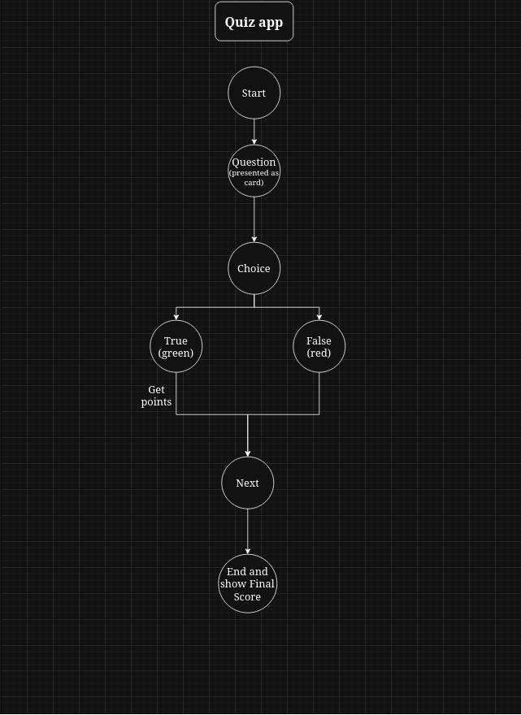

# Quiz application

## Simple architecture


## Tech
- Frontend: React, TypeScript

### Description
This is a simple quiz application built with React and TypeScript.
All features are implemented on the frontend side without any backend.

### Launch
1. Clone the repository
2. Navigate to the project directory
3. Install dependencies
   ```bash
   npm install
   ```
4. Start the development server
   ```bash
   npm start
   ```
5. Open your browser and go to `http://localhost:5173` to use the application.

#### Project license
You can check here -> https://roadmap.sh/projects/quiz-app

